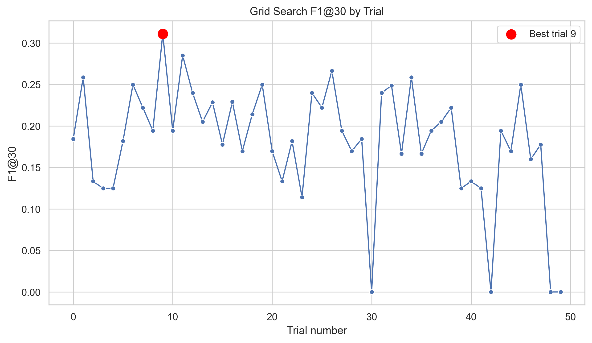
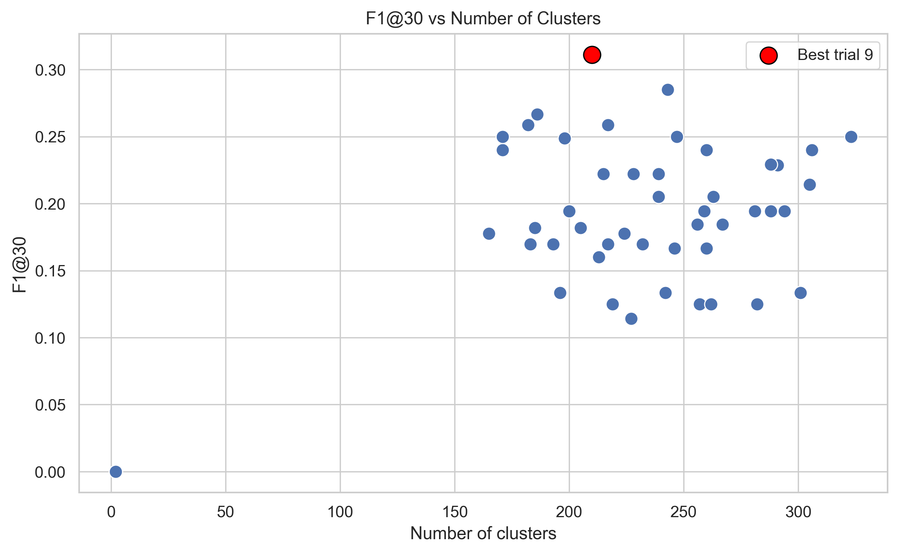
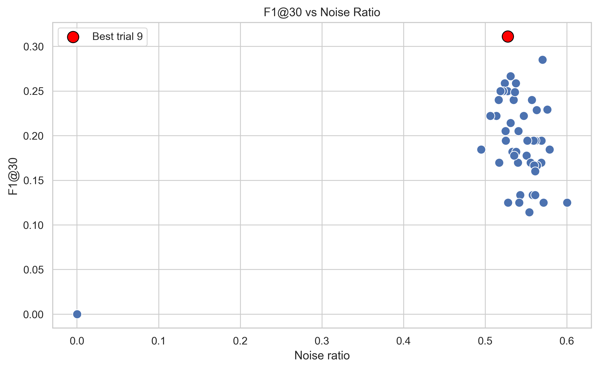

# Technology Event Detection from Reddit Discussions

Final report draft for **PA026 Artificial Intelligence Project**.

## 1. Introduction

Online technology communities often discuss product launches, model releases, infrastructure announcements, and software ecosystem changes before or shortly after they become widely visible. Reddit is a useful source for this type of signal, but it is also noisy: discussions contain duplicates, opinions, support questions, memes, non-technology content, and long-running background topics. The goal of this project is to detect emerging technology events from Reddit discussions in an unsupervised setting.

The task is formulated as event discovery rather than supervised classification. No labeled training set of Reddit events is used to train a detector. Instead, posts are embedded semantically, clustered, labeled, scored, deduplicated, and evaluated against an external pseudo-ground-truth list of real-world technology events. The evaluation is automatic and approximate; it should be interpreted as a consistency check for candidate ranking quality, not as a definitive human-validated benchmark.

The main contributions are:

- an end-to-end pipeline from Reddit dumps or existing parquet files to ranked event candidates;
- semantic clustering using sentence embeddings, UMAP, and HDBSCAN;
- interpretable c-TF-IDF labels for discovered clusters;
- an S4 event ranking score combining volume, temporal concentration, and engagement;
- automatic macro-event deduplication using label similarity and temporal proximity;
- grid-search hyperparameter optimization based on top-30 deduplicated candidate matching.

### Source Code Repository

The complete source code, documentation, evaluation scripts, hyperparameter optimization experiments, and reproducibility materials are available in the GitHub repository:

[Source code repository](https://github.com/samijeddu/Technology-Event-Detection-from-Reddit-Discussions-PA026-Artificial-Intelligence-Project.)

### Dataset Access

The Reddit Pushshift dumps used by this project are not included in the repository because of their size.

The original `.zst` Reddit submission dumps can be downloaded from:

https://academictorrents.com/details/c5ba00048236b60f819dbf010e9034d24fc291fb

After downloading the `.zst` files, users can run the extraction pipeline starting from the extraction modules described in the project documentation.

### Similar Projects

This project is related to unsupervised topic and event discovery systems that combine text embeddings, dimensionality reduction, clustering, and keyword-based interpretation. Similar approaches are used in BERTopic-style topic modeling, social-media event detection pipelines, and news/event monitoring systems that rank emerging topics by temporal burstiness. The main difference is that this project focuses specifically on Reddit technology discussions and combines semantic clustering with S4 temporal scoring, automatic deduplication, and pseudo-ground-truth evaluation against external technology events.

## 2. Methodology

### 2.1 Data Collection and Cleaning

The pipeline supports two input modes. For smoke testing, it can start from a raw Reddit submission dump in `.zst` format. For final experiments, it starts from existing parquet and embedding artifacts to avoid repeatedly processing very large raw files.

The final experiment uses Reddit discussions from August 2025 to October 2025. The raw data is filtered to technology-related discussions and converted into cleaned text fields for embedding. The cleaning stage removes or reduces low-value artifacts while keeping enough context from titles and post text to support semantic clustering.

The smoke test uses `RS_2026-02.zst` and verifies that the complete raw-dump execution path works end to end. It scanned 1,731,207 posts, kept 5,000 posts during extraction, and produced 1,980 cleaned posts.

### 2.2 Sentence Embeddings

Each cleaned Reddit post is represented by a sentence-transformer embedding. The final August-October 2025 run contains:

```text
Embeddings shape: (165733, 384)
```

The embedding representation provides a semantic input space where posts about similar technology topics can be grouped even when they do not share identical keywords.

### 2.3 UMAP Dimensionality Reduction

UMAP is used to reduce the 384-dimensional embedding space before clustering. This improves the suitability of the representation for density-based clustering and reduces computational cost.

The best grid-search parameters used in the final pipeline are:

```text
n_neighbors = 10
n_components = 15
min_dist = 0.03
metric = cosine
```

The final UMAP output shape is:

```text
UMAP shape: (165733, 15)
```

### 2.4 HDBSCAN Clustering

HDBSCAN is used because the number of events is unknown and because the method can assign low-density posts to noise. This is important for Reddit data, where many posts are generic, off-topic, or unrelated to clear events.

The best final parameters are:

```text
min_cluster_size = 100
min_samples = 15
metric = euclidean
cluster_selection_method = eom
```

The final run produced:

```text
HDBSCAN clusters: 210
Noise points: 87447
Noise ratio: 0.5276
```

The relationship between clustering structure, noise, and event-ranking quality is visualized in:

- [Figure: F1@30 vs number of clusters](figures/f1_vs_n_clusters.png)
- [Figure: F1@30 vs noise ratio](figures/f1_vs_noise_ratio.png)
- [Figure: clusters/noise grid-search scatter](figures/hpo_scatter_clusters_noise.png)

### 2.5 c-TF-IDF Labeling

After clustering, each cluster is converted into a document by concatenating the text of its assigned posts. c-TF-IDF is then applied to identify terms and phrases that are characteristic for each cluster relative to the other clusters. The resulting labels make clusters easier to inspect and are also used in event deduplication.

Example cluster themes observed in the final outputs include:

- GPT-5 and GPT model discussions;
- Sora and video generation;
- Claude Code and Sonnet;
- iPhone 17 discussions;
- Gemini-related discussions;
- GPU and NVIDIA infrastructure discussions.

### 2.6 S4 Event Ranking

Clusters are ranked using the S4 event score:

```text
S4 = peak_count * log(1 + n_posts) * burst_share * log(1 + engagement)
```

where:

- `peak_count` is the maximum number of posts in the cluster on a single day;
- `n_posts` is the total number of posts assigned to the cluster;
- `burst_share = peak_count / n_posts` measures temporal concentration;
- `engagement = avg_score + avg_comments` measures average Reddit interaction level.

This score favors clusters that are both large and temporally concentrated, while also giving additional weight to clusters with higher user engagement. The logarithmic terms reduce the dominance of very large or very high-engagement clusters.

The pipeline keeps:

```text
event_candidate_score = S4_full_metadata
score_method = "S4_full_metadata"
```

### 2.7 Deduplication

Reddit event discussions often split into multiple clusters, especially when users discuss the same event using different posts, titles, or subreddits. To reduce duplicate event candidates, the pipeline applies automatic macro-event deduplication after S4 ranking.

Two candidates are considered duplicates when:

- the Jaccard similarity between terms from `interpreted_label_ctfidf` and `ctfidf_top_terms` is at least `0.30`;
- their `peak_date` values are within two days.

Connected duplicate candidates are assigned an `auto_macro_event_id`. For each macro-event, the candidate with the highest S4 score is kept. Evaluation is then performed on the top-30 deduplicated event candidates.

### 2.8 Implementation Summary

The implementation is organized as a modular Python pipeline under `src/`. Extraction, cleaning, embedding generation, dimensionality reduction, clustering, cluster summarization, c-TF-IDF labeling, validation, and comparison/HPO code are separated into stage-specific modules. The main execution entry point is `main.py`, which selects a `RUN_MODE` and enables only the relevant stages for smoke testing, final evaluation, or generalization testing. Intermediate artifacts are stored under `data/`, while ranked candidates, evaluation files, HPO results, report figures, and generated tables are stored under `outputs/` and `docs/`.

## 3. Hyperparameter Optimization

The final optimization uses grid search rather than Optuna. The full grid contains 144 possible configurations:

```text
n_neighbors = [10, 15, 20, 25]
n_components = [10, 15]
min_dist = [0.0, 0.03, 0.05]
min_cluster_size = [60, 80, 100]
min_samples = [15, 25]
```

From these 144 configurations, 50 configurations were selected deterministically using `random_state = 42`, distributed across the grid. Each trial used:

```text
S4_full_metadata scoring
deduplicated top-30 event candidates
matching threshold = 0.55
```

The evaluation metrics are:

- `Precision@30`: fraction of top-30 deduplicated candidates matched to at least one real event;
- `Recall@30`: fraction of pseudo-ground-truth real events matched by the top-30 candidates;
- `F1@30`: harmonic mean of Precision@30 and Recall@30.

The objective score is `F1@30`, with penalties for degenerate clustering:

```text
if n_clusters < 20: objective_score *= 0.25
if n_clusters > 300: objective_score *= 0.5
if noise_ratio > 0.75: objective_score *= 0.5
```

The grid-search outputs used for the report are:

- [Table: top 10 grid-search results](tables/top10_grid_search_results.csv)
- [Table: best parameters and final metrics](tables/best_params_summary.csv)
- [Figure: F1@30 by trial](figures/f1_vs_trial.png)
- [Figure: mean F1@30 by n_neighbors and min_cluster_size](figures/heatmap_neighbors_cluster_size_f1.png)

## 4. Hyperparameter Optimization Results

The grid search evaluated 50 selected configurations from the full 144-combination search space. Each configuration used S4 scoring, event-candidate deduplication, top-30 candidate evaluation, and a matching threshold of 0.55. The final configuration was selected by F1@30, with penalties for degenerate clustering behavior.

### Figure 1. F1@30 vs Trial



**Caption.** F1@30 across the evaluated HPO trials. The plot shows how candidate-ranking quality varied across the sampled UMAP and HDBSCAN configurations.

The best trial reached the strongest F1@30 among the evaluated configurations and was selected because it improved the balance between precision and recall in the top-30 deduplicated event candidates. This supports using the corresponding UMAP and HDBSCAN parameters for the final Aug-Oct evaluation.

### Figure 2. F1@30 vs Number of Clusters



**Caption.** Relationship between the number of HDBSCAN clusters and F1@30. The selected configuration produced 210 clusters.

The result indicates that the strongest configuration was not the one with the fewest or most clusters. Around 200 clusters provided a useful compromise: enough granularity to separate distinct technology events, but not so much fragmentation that one real event was split into many weak candidates. This supports the final choice of `min_cluster_size = 100` and `min_samples = 15`.

### Figure 3. Noise Ratio vs F1@30



**Caption.** Relationship between HDBSCAN noise ratio and F1@30. The final configuration retained a substantial noise fraction while preserving useful event clusters.

The selected configuration had a noise ratio of 0.5276. This is high, but appropriate for noisy Reddit discussions: many posts are not specific event evidence and should not necessarily form clusters. The grid-search result suggests that moderate-to-high noise is acceptable when the remaining clusters are coherent enough to produce high-quality S4-ranked event candidates.

Additional generated HPO diagnostics are available in:

- [clusters vs noise ratio](figures/clusters_vs_noise_ratio.png)
- [cluster/noise/F1 scatter](figures/hpo_scatter_clusters_noise.png)
- [mean F1 heatmap by neighbors and cluster size](figures/heatmap_neighbors_cluster_size.png)
- [mean F1 heatmap from grid-search results](figures/heatmap_neighbors_cluster_size_f1.png)

### Best Hyperparameters

| Component | Parameter | Value |
|---|---:|---:|
| UMAP | `n_neighbors` | 10 |
| UMAP | `n_components` | 15 |
| UMAP | `min_dist` | 0.03 |
| HDBSCAN | `min_cluster_size` | 100 |
| HDBSCAN | `min_samples` | 15 |

These parameters were applied to the final Aug-Oct pipeline run. The resulting evaluation matched 14 of 30 external events, with Precision@30 = 0.2333, Recall@30 = 0.4667, and F1@30 = 0.3111. The same parameters were then reused without modification for the temporally separated Nov-Jan generalization experiment.

## 5. Results and Discussion

### 5.1 Final Metrics

Aug-Oct was used for hyperparameter search and the main quantitative evaluation. Nov-Jan was used as a temporally separated generalization test with the same hyperparameters applied without modification.

| Dataset | Posts | Clusters | Noise ratio | Precision@30 | Recall@30 | F1@30 | Matched events |
|---|---:|---:|---:|---:|---:|---:|---:|
| Aug 2025-Oct 2025 | 165,733 | 210 | 0.5276 | 0.2333 | 0.4667 | 0.3111 | 14 / 30 |
| Nov 2025-Jan 2026 | 140,669 | 187 | 0.5429 | 0.2000 | 0.3000 | 0.2400 | 9 / 30 |

Main evaluation dataset:

| Metric | Value |
|---|---:|
| Dataset | Aug 2025-Oct 2025 |
| Posts | 165,733 |
| Embeddings shape | `(165733, 384)` |
| UMAP shape | `(165733, 15)` |
| HDBSCAN clusters | 210 |
| Noise points | 87,447 |
| Noise ratio | 0.5276 |
| Silhouette score | 0.4947 |
| Matched real events | 14 / 30 |
| Precision@30 | 0.2333 |
| Recall@30 | 0.4667 |
| F1@30 | 0.3111 |

Supporting report assets:

- [Table: best parameters and final metrics](tables/best_params_summary.csv)
- [Figure: F1@30 vs number of clusters](figures/f1_vs_n_clusters.png)
- [Figure: F1@30 vs noise ratio](figures/f1_vs_noise_ratio.png)
- [Figure: clusters/noise grid-search scatter](figures/hpo_scatter_clusters_noise.png)

### 5.2 Best Parameters

| Component | Parameter | Value |
|---|---:|---:|
| UMAP | `n_neighbors` | 10 |
| UMAP | `n_components` | 15 |
| UMAP | `min_dist` | 0.03 |
| HDBSCAN | `min_cluster_size` | 100 |
| HDBSCAN | `min_samples` | 15 |

The best configuration produced 210 clusters, which appears to be a useful tradeoff for this dataset. A much smaller number of clusters would merge unrelated technology events into broad themes, while a much larger number of clusters would over-fragment individual events into many small candidate clusters. The selected result still contains substantial noise, but this is expected in open-domain Reddit discussions.

### 5.3 Discussion

The best result matched 14 of 30 pseudo-ground-truth real events using automatic semantic matching. This suggests that the pipeline can recover a meaningful subset of major technology events from Reddit discussions without supervised event labels.

The detected clusters include discussions around GPT-5 and related GPT models, Sora video generation, Claude Code and Sonnet, iPhone 17, Gemini, and GPU/NVIDIA topics. These examples indicate that the semantic clustering and c-TF-IDF labeling stages are able to surface interpretable technology themes.

However, the evaluation has important limitations. The matching is based on semantic similarity between candidate text and a pseudo-ground-truth event list. It may fail when a cluster discusses an event indirectly, or it may count a match when the semantic overlap is high but the event is not exactly the same. Therefore, the reported metrics should be interpreted as approximate automatic evaluation, not as a final human-validated event detection score.

The system also faces the usual tradeoff between over-fragmentation and overly coarse clustering. Smaller clusters may isolate specific events but duplicate them across multiple candidate groups. Larger clusters may capture broad topics but lose event specificity. The deduplication step partially addresses this issue but remains based on simple lexical similarity and temporal proximity.

### 5.4 Generalization Experiment

The best hyperparameters found on the August-October 2025 dataset were applied without modification to a temporally separate dataset covering November 2025 to January 2026. This experiment tests whether the pipeline behavior remains stable outside the optimization period.

| Metric | Value |
|---|---:|
| Dataset | Nov 2025-Jan 2026 |
| Date range | 2025-11-01 to 2026-01-31 |
| Cleaned posts | 140,669 |
| Embeddings shape | `(140669, 384)` |
| UMAP shape | `(140669, 15)` |
| HDBSCAN clusters | 187 |
| Noise points | 76,370 |
| Noise ratio | 0.5429 |
| Matched real events | 9 / 30 |
| Precision@30 | 0.2000 |
| Recall@30 | 0.3000 |
| F1@30 | 0.2400 |

The generalization run produced 187 clusters, compared with 210 clusters in the main August-October dataset. This is a similar order of magnitude and suggests that the selected UMAP/HDBSCAN configuration does not only work for the optimization period. The noise ratio, 0.5429, is also close to the main run noise ratio of 0.5276. This behavior indicates good robustness of the overall pipeline under a temporally separated dataset.

The lower F1@30 on Nov-Jan indicates performance degradation under temporal shift, but the pipeline still recovered 9 of 30 external events. Matched Nov-Jan examples include Cloudflare global outage, Cloudflare December outage, Kimi K2.5 release, Google Antigravity launch, Microsoft NVIDIA Anthropic partnership, NVIDIA DLSS 4.5, GPT-4o ecosystem updates, and Gemini 3 Search integration.

The generalization result should still be interpreted carefully. It verifies stability of the unsupervised clustering and ranking process, but it does not replace manual validation or a larger external benchmark.

### 5.5 Limitations

The reported evaluation is pseudo-ground-truth based and automatic. Automatic semantic matching is imperfect: it may miss indirect discussions of real events, and it may accept high-similarity pairs that are not exact event matches. Ground truth construction is manual, so the selected external event list influences the measured recall and F1.

Some real events are broader than Reddit cluster labels, which can make otherwise relevant clusters appear only partially aligned with the reference event. More generally, the method is an unsupervised event discovery pipeline, not a supervised event classification system.

## 6. Reproducibility and Execution Modes

The pipeline is controlled by `RUN_MODE` in `main.py`.

### `smoke_zst_feb_2026`

This mode validates the full raw-dump path:

```text
RUN_MODE = "smoke_zst_feb_2026"
Raw file: RS_2026-02.zst
Scanned posts: 1,731,207
Kept posts: 5,000
Cleaned posts: 1,980
Embeddings shape: (1980, 384)
Clusters: 3
```

This run is not intended to produce high-quality event discovery results. Its purpose is to show that the complete `.zst` to event-candidates pipeline executes successfully.

### `final_aug_oct_2025`

This is the final result mode:

```text
RUN_MODE = "final_aug_oct_2025"
Dataset: Aug 2025-Oct 2025
```

It uses existing parquet and embedding files, then regenerates UMAP, HDBSCAN, cluster summaries, c-TF-IDF labels, S4 scores, deduplicated candidates, and final top-30 event candidates using the best grid-search parameters.

### `generalization_nov_jan`

This mode tests robustness on a later period:

```text
RUN_MODE = "generalization_nov_jan"
Dataset: Nov 2025-Jan 2026
Date range: 2025-11-01 to 2026-01-31
Cleaned posts: 140669
Embeddings shape: (140669, 384)
UMAP shape: (140669, 15)
Clusters: 187
Noise points: 76370
Noise ratio: 0.5429
```

The Aug-Oct hyperparameters are applied without modification. This makes the run a temporally separated generalization experiment rather than another hyperparameter tuning run.

A compact comparison of all three execution modes is available as:

- [Table: run summary](tables/run_summary.csv)

## 7. Conclusion

This project demonstrates an unsupervised event discovery pipeline for Reddit technology discussions. It combines semantic embeddings, dimensionality reduction, density-based clustering, c-TF-IDF labeling, S4 event ranking, deduplication, and automatic evaluation against real-world technology events.

The final August-October 2025 run produced 210 clusters and matched 14 of 30 pseudo-ground-truth real events in the top-30 deduplicated candidates. The results show that unsupervised semantic clustering can surface meaningful technology events, but also that automatic matching and clustering-based event discovery remain imperfect.

On the temporally separated November 2025-January 2026 dataset, the same configuration produced 187 clusters and matched 9 of 30 external events. This lower F1@30 shows degradation under temporal shift, while still indicating that the pipeline can recover part of a new period's event landscape without re-tuning.

Future work should include:

- improved entity and event matching;
- stronger temporal burst detection;
- manual human validation of candidate events;
- richer deduplication using semantic similarity rather than only label Jaccard similarity;
- larger external validation datasets across additional time periods.

## Appendix

### A. Commands

Create and activate a virtual environment:

```powershell
python -m venv .venv
.\.venv\Scripts\activate
pip install -r requirements.txt
```

Run the pipeline:

```powershell
python main.py
```

Change execution mode in `main.py`:

```python
RUN_MODE = "final_aug_oct_2025"
```

Other available modes:

```python
RUN_MODE = "smoke_zst_feb_2026"
RUN_MODE = "generalization_nov_jan"
```

### A.1 Running Examples

The main reproducible execution examples are:

```powershell
# Final Aug-Oct evaluation run
python main.py
```

with:

```python
RUN_MODE = "final_aug_oct_2025"
```

```powershell
# Raw dump smoke test on one downloaded month
python main.py
```

with:

```python
RUN_MODE = "smoke_zst_feb_2026"
```

```powershell
# Temporally separated Nov-Jan generalization run
python main.py
```

with:

```python
RUN_MODE = "generalization_nov_jan"
```

Example generated visual outputs used in the report include:

- [F1@30 vs trial](figures/f1_vs_trial.png)
- [F1@30 vs number of clusters](figures/f1_vs_n_clusters.png)
- [F1@30 vs noise ratio](figures/f1_vs_noise_ratio.png)
- [cluster/noise/F1 scatter](figures/hpo_scatter_clusters_noise.png)

### B. Important Output Paths

Report figures:

```text
docs/figures/f1_vs_trial.png
docs/figures/f1_vs_n_clusters.png
docs/figures/f1_vs_noise_ratio.png
docs/figures/hpo_scatter_clusters_noise.png
docs/figures/heatmap_neighbors_cluster_size_f1.png
```

Report tables:

```text
docs/tables/top10_grid_search_results.csv
docs/tables/best_params_summary.csv
docs/tables/run_summary.csv
```

Final candidate outputs:

```text
outputs/aug_2025_oct_2025/temporal_analysis/event_candidates_ranked.csv
outputs/aug_2025_oct_2025/temporal_analysis/event_candidates_ranked_deduplicated.csv
outputs/aug_2025_oct_2025/temporal_analysis/event_candidates_top30_deduplicated.csv
```

Grid search outputs:

```text
outputs/grid_search_s4_top30_threshold055/grid_search_results.csv
outputs/grid_search_s4_top30_threshold055/best_params.json
outputs/grid_search_s4_top30_threshold055/latest_trial.json
```

Best trial outputs:

```text
outputs/grid_search_s4_top30_threshold055/trial_9/event_candidates_ranked.csv
outputs/grid_search_s4_top30_threshold055/trial_9/event_candidates_ranked_deduplicated.csv
outputs/grid_search_s4_top30_threshold055/trial_9/event_candidates_top30_deduplicated.csv
outputs/grid_search_s4_top30_threshold055/trial_9/event_candidate_matching.csv
outputs/grid_search_s4_top30_threshold055/trial_9/event_candidate_metrics.json
```

### C. Files Generated by the Pipeline

Typical generated files include:

```text
data/raw/reddit_tech_month_YYYY_MM.parquet
data/interim/<run_name>/reddit_tech_cleaned_for_embeddings.parquet
data/processed/<run_name>/reddit_tech_metadata.parquet
data/processed/<run_name>/reddit_tech_embeddings.npy
data/processed/<run_name>/reddit_tech_umap_embeddings.npy
data/processed/<run_name>/reddit_tech_posts_with_clusters.parquet
data/processed/<run_name>/reddit_tech_cluster_labels.npy
data/processed/<run_name>/reddit_tech_cluster_summary.csv
outputs/<run_name>/temporal_analysis/event_candidates_ranked.csv
outputs/<run_name>/temporal_analysis/event_candidates_ranked_deduplicated.csv
outputs/<run_name>/temporal_analysis/event_candidates_top30_deduplicated.csv
```

### D. Notes for Reproduction

Large raw dumps, parquet files, embeddings, and generated outputs are not included in Git. To reproduce the final run, the expected August-October 2025 parquet and embedding files must be available locally. To reproduce the raw smoke test, the file `RS_2026-02.zst` must be available either in the project external data directory or at the configured local fallback path.

The final evaluation is automatic and pseudo-ground-truth based. It is useful for comparing configurations, but a final scientific interpretation should include manual inspection of the top event candidates.
